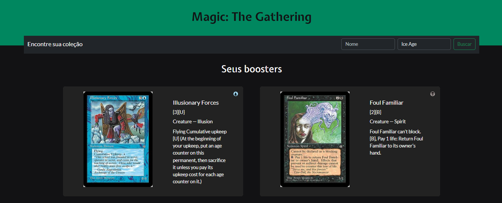

<h1 align="center"> DesafioLinked, MTG API</h1>

 

  

  <em>Confira o resultado do app em: https:/https://desafio-linked-hevelinlima.vercel.app/</em>

## 💻 Projeto

A proposta deste desafio consiste em desenvolver um fluxo automatizado para abrir pacotes de cartas de Magic: The
Gathering a partir de uma coleção específica, e possui as seguintes funcionalidades:

- Componente de Filtros de Pesquisa: Formulário com entrada de texto e seleção de bloco.
- Componente de Resultados da Pesquisa: Lista de coleções com propriedades.
- Fluxo de Seleção e Requisição de Cartas
  - Enviar filtros concatenados como query params.
  - Escolha de uma coleção para iniciar o próximo fluxo.
  - Obtenção de 15 cartas aleatórias e filtro por tipo "creature".
  - Repetição da requisição até obter 30 Cartas de Tipo "Creature".

Para o desenvolvimento dessas funcionalidades, foram utilizados conceitos como:

- HTTP Client
- Componentes
- RxJS
- HttpClientModule
- FormsModule e ReactiveFormsModule

## 🚀 Tecnologias

Esse projeto foi desenvolvido com as seguintes tecnologias:

- Angular
- TypeScript
- HTML + CSS
- Bootstrap
- Git e Github

---

This project was generated with [Angular CLI](https://github.com/angular/angular-cli) version 17.3.7.

## Development server

Run `ng serve` for a dev server. Navigate to `http://localhost:4200/`. The application will automatically reload if you change any of the source files.

## Code scaffolding

Run `ng generate component component-name` to generate a new component. You can also use `ng generate directive|pipe|service|class|guard|interface|enum|module`.

## Build

Run `ng build` to build the project. The build artifacts will be stored in the `dist/` directory.

## Running unit tests

Run `ng test` to execute the unit tests via [Karma](https://karma-runner.github.io).

## Running end-to-end tests

Run `ng e2e` to execute the end-to-end tests via a platform of your choice. To use this command, you need to first add a package that implements end-to-end testing capabilities.

## Further help

To get more help on the Angular CLI use `ng help` or go check out the [Angular CLI Overview and Command Reference](https://angular.io/cli) page.

---

Feito com ♥ by hevelinlima
